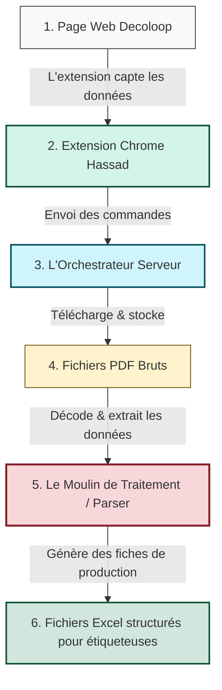
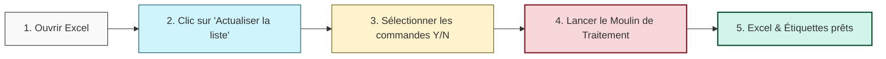

# 🌾 PDFXport : Automatisation de la Récolte de PDF
*Document de présentation destiné aux équipes opérationnelles et décisionnelles (Non-technique)*

---

## 🎯 1. Le Problème & La Solution

### ❌ Le Problème (Avant)
Chaque jour, les équipes doivent récupérer manuellement des centaines de fiches et étiquettes de production au format PDF depuis la plateforme **SievalHub (Decoloop)**. 
Ce travail est :
* **Extrêmement chronophage :** Cliquer sur chaque projet, attendre l'affichage, cliquer sur télécharger, enregistrer sous le bon nom...
* **Fastidieux et répétitif :** Des milliers de clics répétés au quotidien.
* **Sujet aux erreurs :** Oubli d'un fichier, doublons ou erreurs de renommage.

###  La Solution : PDFXport (Aujourd'hui)
**PDFXport** automatise entièrement cette tâche en créant un "convoi de moisson" numérique :
* **Un clic pour tout capturer :** Vous sélectionnez vos projets sur la page web, et le système s'occupe du reste.
* **Téléchargement automatique en arrière-plan :** Les fichiers PDF sont récupérés à la chaîne, renommés précisément selon le numéro de commande, et rangés au bon endroit sans aucune intervention humaine.
* **Fiabilité absolue :** Aucun oubli, aucune erreur humaine possible.

---

## 🚜 2. Le Fonctionnement Actuel (La Solution Hybride)

Actuellement, le projet s'articule autour de quatre éléments clés qui communiquent ensemble :

1. **L'Extension Web Hassad (Le Capteur) :** Intégrée à votre navigateur Chrome, elle détecte et mémorise les informations des projets affichés à l'écran. Un indicateur visuel (HUD) moderne s'affiche sur la page pour vous montrer la progression en temps réel (ex: `56 / 167 récoltés`).
2. **L'Orchestrateur (Moissonneuse-Serveur) :** Le mini-logiciel qui tourne silencieusement sur votre PC (représenté par le petit tracteur dans votre barre des tâches). Il reçoit les demandes de l'extension et télécharge les PDF à la chaîne.
3. **Le Moulin de Traitement (Moissonneuse-Moulin / Parser) :** 
   C'est le **cerveau intelligent** du système. Loin d'un simple copieur de fichiers, ce programme :
   * **Décode le contenu des PDF :** Il ouvre et analyse le texte brut et la structure vectorielle interne de chaque PDF de production.
   * **Extrait et trie les données :** Il identifie automatiquement les dimensions, métrages, coloris, sens de tissu et matières.
   * **Sépare et valide :** Il découpe intelligemment les commandes complexes multi-produits, applique des filtres de validation industrielle stricts, et formate les données pour éliminer tout risque d'erreur d'impression.
4. **Le Fichier de Sortie (Excel) :** Le Moulin génère des fichiers Excel standardisés, nettoyés et parfaitement structurés, prêts à être importés dans vos machines d'impression d'étiquettes de production !

---

## 📊 3. L'Alternative Future : La Solution 100% Microsoft Excel

Si nous obtenons un accès direct à la base de données ou à l'API du site web, nous pouvons éliminer le navigateur web et faire tourner **l'intégralité du système directement dans Microsoft Excel**.

### 🔄 Le Workflow Excel (Futur)
Plus besoin d'ouvrir Chrome, d'activer une extension ou de faire tourner un serveur local. Tout se passe dans un unique fichier Excel :

### 💡 Les avantages de la solution Excel :
> [!TIP]
> * **Simplicité d'utilisation maximale :** Tout le monde sait utiliser un tableau Excel. Une ligne, une commande, une colonne à cocher (Oui/Non).
> * **Zéro logiciel à installer :** Plus besoin d'extension Chrome ni de serveur en arrière-plan.
> * **Historique intégré :** Vous voyez directement dans Excel quels fichiers ont été téléchargés avec succès, à quelle date, et lesquels ont échoué.
> * **Maintenance simplifiée :** Une seule et unique interface à mettre à jour en cas d'évolution.

---

## 🏁 Conclusion

La **solution hybride actuelle** est une réussite totale qui libère déjà vos équipes des tâches répétitives et sécurise la chaîne d'impression des étiquettes grâce à la puissance d'analyse du **Moulin (Parser)**.

L'**alternative Excel** représente la prochaine étape de maturité : transformer un système informatique multi-composants en un simple outil de bureau universel, accessible à tous, extrêmement robuste et simple à piloter.
